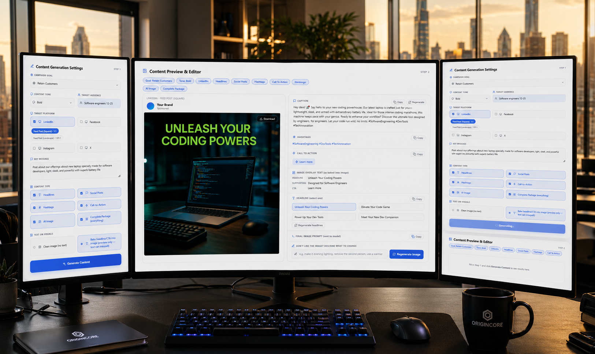

# AI Marketing Content Generator — Internal Tool

Generates platform-tailored marketing copy (headlines, captions, hashtags, CTAs)
and AI images for a campaign, previewed in a lightweight local web UI.


```
AIcontentgeneration/
├── README.md          
├── server.py
├── generator.py
├── prompt_builder.py
├── models.py
├── config.py
├── validators.py
├── static/
│   └── index.html
├── generated_images/  (created automatically)
├── .env
└── requirements.txt
```

---

## 1. What each file does

| File | Purpose |
|---|---|
| `server.py` | FastAPI backend. Defines every HTTP endpoint (`/generate`, `/regenerate-headline`, `/regenerate-caption`, `/regenerate-image`, `/options`). This is what you run. |
| `static/index.html` | The entire frontend — HTML/CSS/JS in one file. Calls the endpoints in `server.py` and renders the results. No build step, no framework. |
| `generator.py` | `MarketingContentGenerator` class. Talks to OpenAI: sends the text-generation call, sends the image-generation call, saves the image file, runs quality checks. |
| `prompt_builder.py` | **All prompt logic lives here.** Turns campaign settings into the actual strings sent to the model. See section 3 below. |
| `models.py` | Plain data classes / enums: `CampaignGoal`, `ContentTone`, `Platform`, `ContentType`, `CampaignInput`. Defines what a "campaign" is. |
| `config.py` | Static reference data: per-platform style rules (`PLATFORM_RULES`), per-platform format/aspect-ratio options (`PLATFORM_FORMATS`), goal → marketing framework mapping (`GOAL_STRATEGY`), tone descriptions (`TONE_NOTES`), and which models to use. |
| `validators.py` | Runs basic quality checks on generated content (e.g. length warnings) — not covered in detail here, see the file itself. |
| `app.py` | Old Streamlit version of the internal UI. No longer used now that `static/index.html` + `server.py` exist. Safe to delete. |

---

## 2. Which AI models are used

Set in `config.py`:

```python
TEXT_MODEL_DEFAULT = "gpt-4o"        # headlines, captions, hashtags, CTA, image_prompt
IMAGE_MODEL_DEFAULT = "gpt-image-1"  # actual image generation
IMAGE_SIZE_DEFAULT = "1024x1024"     # fallback only — real size is picked automatically
                                      # per orientation, see ORIENTATION_TO_IMAGE_SIZE
```

To change models, edit these two lines only. Everything else (prompt building,
generator calls) reads from here — nothing is hardcoded elsewhere.

---

## 3. The prompt flow (how a request becomes AI output)

**Step 1 — Text generation** (`prompt_builder.build_text_prompt`)

One call per selected platform. It combines:

- `campaign_goal` → looked up in `GOAL_STRATEGY` → tells the model which marketing
  framework to silently apply (AIDA, PAS, Scarcity, etc.)
- `content_tone` → looked up in `TONE_NOTES` → vocabulary/rhythm guidance
- `target_audience` → inserted as free text, read directly by the model
- `platform` + chosen `format` (e.g. Instagram Story vs Feed) → pulls style,
  character-length target, hashtag rules, and aspect ratio from
  `PLATFORM_RULES` / `PLATFORM_FORMATS` in `config.py`
- `key_message` → the factual anchor the model is told to stay grounded in
- optional brand fields (company, industry, colors, etc.) → only included if filled in

The model returns strict JSON: `headlines`, `social_post`, `cta`, `hashtags`,
`image_prompt`, `image_text`. This is one AI-authored blob — the app then
filters it down to only the content types the user actually checked in Step 1.

**Step 2 — Image generation** (`prompt_builder.build_image_generation_prompt`)

The `image_prompt` string from Step 1 (the AI's own scene description) gets
wrapped with a fixed technical spec before going to the image model:
photorealism rules, image-quality rules, a numeric text safe-zone (so any
baked-in text can't get cropped), typography rules, and a negative prompt.
This wrapper is the same for every image, every time — it's not something
the model writes, it's appended in code.

**Step 3 — Regeneration (headline / caption / image)**

Each "Regenerate" button hits its own lightweight endpoint
(`build_headline_regen_prompt`, `build_caption_regen_prompt`,
`build_image_revision_prompt`) which reuses the same campaign context but
explicitly tells the model what NOT to repeat (previous headlines/caption)
or exactly what to change (image feedback text), keeping everything else
from the original intact.

If you want to change *how* the AI writes things, `prompt_builder.py` is the
only file you need to touch.

---

## 4. Packages to install

```
fastapi
uvicorn
openai
python-dotenv
pydantic
```

`requirements.txt` in the project currently only lists `openai` and
`python-dotenv` — add the rest:

```
openai>=1.40.0
python-dotenv>=1.0.0
fastapi
uvicorn
pydantic
```

Install:

```bash
pip install -r requirements.txt
```

---

## 5. How to run it

1. Put your real key in `.env` (not `.env.example`):
   ```
   OPENAI_API_KEY=sk-your-real-key-here
   ```
2. From the project root:
   ```bash
   uvicorn server:app --reload --port 8000
   ```
3. Open in a browser:
   ```
   http://localhost:8000/static/index.html
   ```

That's it — no separate frontend server needed, FastAPI serves the HTML file
directly via the `/static` mount in `server.py`.

---

## 6. Integrating this into the bigger project

This tool is self-contained on purpose. To plug it into a larger app:

- **Keep as a separate service:** run `server.py` on its own port (as above)
  and have the main project call its endpoints (`/generate`, etc.) over HTTP
  like any other internal API. Simplest option, no code merging needed.

- **Import the logic directly:** if the bigger project is also Python, you
  can skip `server.py`/`static/index.html` entirely and just import
  `MarketingContentGenerator` from `generator.py` directly:
  ```python
  from generator import MarketingContentGenerator
  from models import CampaignInput, CampaignGoal, ContentTone, Platform, ContentType

  gen = MarketingContentGenerator()
  campaign = CampaignInput(
      campaign_goal=CampaignGoal.DRIVE_AWARENESS,
      content_tone=ContentTone.PROFESSIONAL,
      target_audience="...",
      target_platforms=[Platform.LINKEDIN],
      key_message="...",
  )
  results = gen.generate(campaign, [ContentType.COMPLETE_PACKAGE])
  ```
  Then build your own UI on top — `generator.py` has zero dependency on
  FastAPI or the HTML file.

- **Mount the FastAPI app inside a bigger FastAPI app:** if the main project
  is also FastAPI, `server.py`'s `app` object can be mounted as a sub-app:
  ```python
  from server import app as content_gen_app
  main_app.mount("/content-gen", content_gen_app)
  ```

Either way, the only things that need an `OPENAI_API_KEY` are `generator.py`
(via `.env`) — nothing else in the codebase touches the API directly.

---

## 7. Things you'll likely want to change first

- `config.py` → models, platform formats/aspect ratios, tone/goal wording
- `prompt_builder.py` → the actual prompt text sent to the model
- `static/index.html` → colors/branding (all in the `:root { --accent: ... }`
  CSS variables at the top of the `<style>` block)
- Delete `app.py` (old Streamlit version, unused) once you've confirmed the
  new HTML/FastAPI version covers everything you need.
